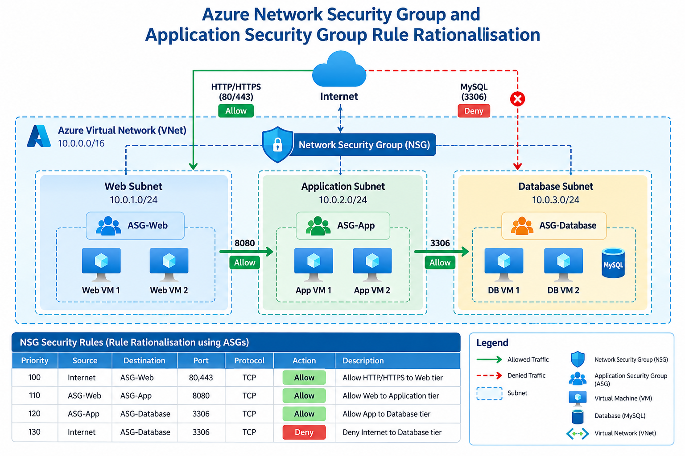

# Architecture

This folder contains the architecture diagrams for the Azure Network Security Group and ASG Rule Rationalisation project.

## Three-Tier Network Architecture

The project is designed using three security layers:

* **Web Layer** – Receives HTTP/HTTPS requests from users.
* **Application Layer** – Processes backend requests.
* **Database Layer** – Stores application data and accepts traffic only from the Application layer.

Application Security Groups (ASGs) group virtual machines based on their role, while Network Security Groups (NSGs) control communication between these groups.

## Network Architecture Diagram

The following diagram shows the Azure NSG and ASG architecture used in this project.

